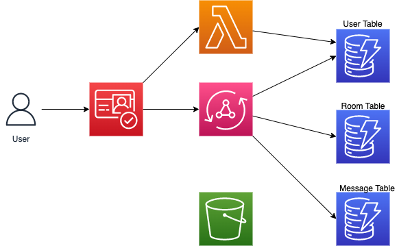

## AppSync Chat App CDK Backend

This repo is part of an official AWS Blog post that showcases how to create a serverless, real-time backend that integrates with a frontend application.

## Services Used

### Cognito

The `lib/authStack.ts` file creates the following services

- Cognito Userpool
- Cognito Userpool Group (if specified)
- Cognito Identity Pool

🗒️ The identity pool helps in providing IAM permission access to both authenticated and unauthenticated users as well as AWS services such as Amazon S3.

### Lambda

The `lib/functions` directory contains a `postConfirmationTrigger` folder. The Lambda function in this folder adds a user to DynamoDB after a user signs up through our Cognito service.

### S3

The `lib/fileStorage.ts` file creates an Amazon S3 bucket and comes configured with managed polcies that are in line with what the [Amplify Storage](https://docs.amplify.aws/cli/storage/import/#configuring-iam-role-to-use-amplify-recommended-policies) library uses as acceptable defaults.

### AppSync API

The`lib/apiStack.ts` file creates an AppSync API that is based on a `Todo` application.

Note that this stack comes preconfigured with the following:

- A sample graphql schema
- Userpool authorization
- API Key authorization
- IAM authorization
- DynamoDB as a datasource

In addition, this package makes use of the `@aws-cdk/aws-appsync-alpha` [npm package](https://www.npmjs.com/package/@aws-cdk/aws-appsync-alpha) for easiliy creating the request and response mapping templates.

### DynamoDB API

The `lib/databaseStack.ts` file creates a single DynamoDB table that is used as a datasource for the AppSync API above.

## Integrating with a frontend

For a full walkthrough on how one might integrate the output from these stacks into a frontend application that makes use of AWS Amplify libraries, refer to this [fullstack guide](https://blog.focusotter.com/the-fullstack-guide-to-creating-appsync-apis-with-the-aws-cdk#heading-interacting-with-a-nextjs-frontend).

## Useful commands

- `npm run build` compile typescript to js
- `npm run watch` watch for changes and compile
- `cdk deploy` deploy this stack to your default AWS account/region
- `cdk diff` compare deployed stack with current state
- `cdk synth` emits the synthesized CloudFormation template

## Security

See [CONTRIBUTING](CONTRIBUTING.md#security-issue-notifications) for more information.

## License

This library is licensed under the MIT-0 License. See the LICENSE file.
